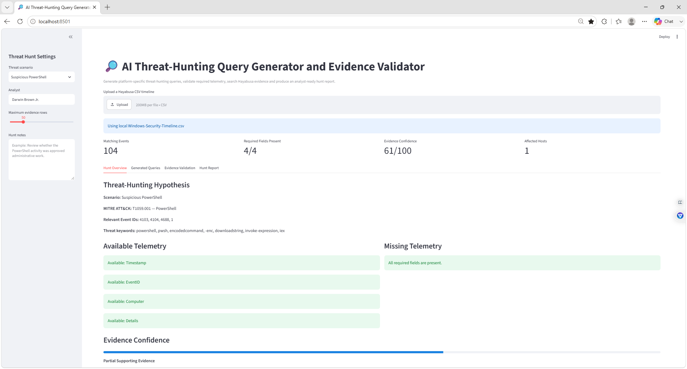
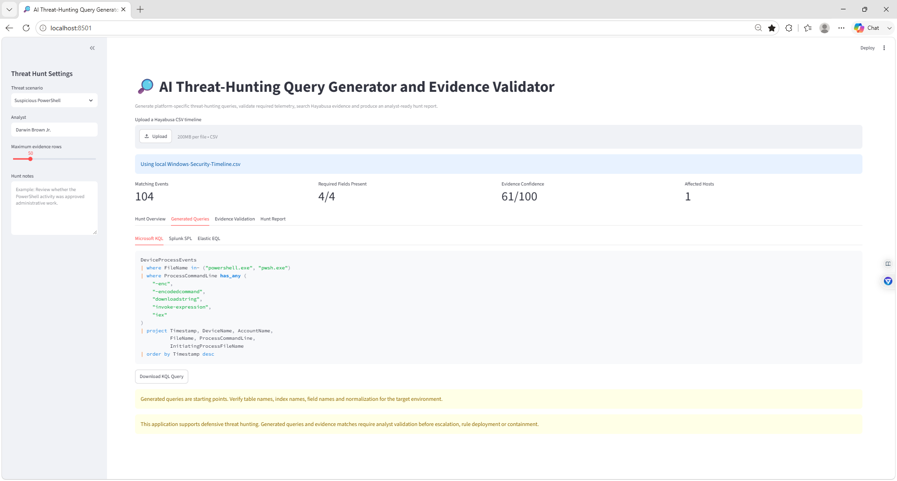
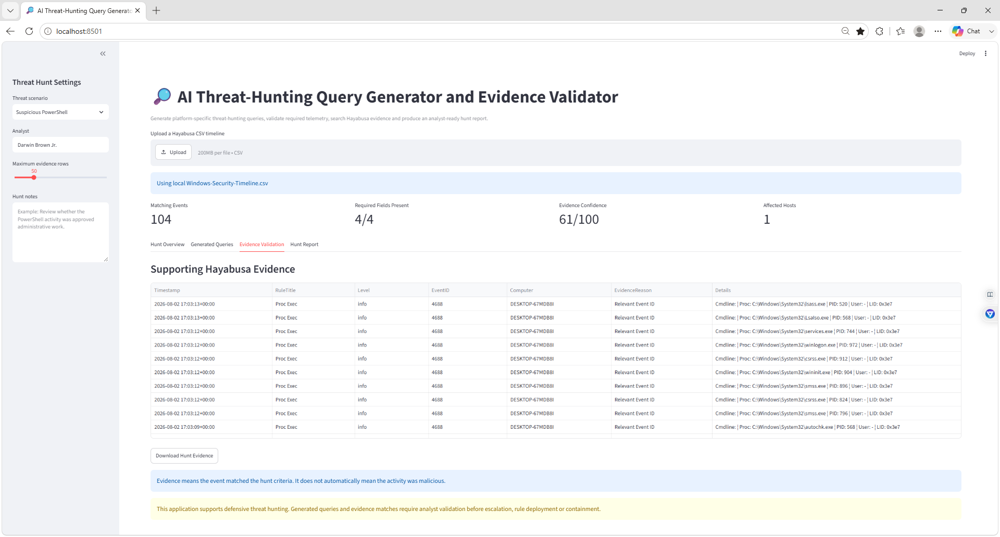
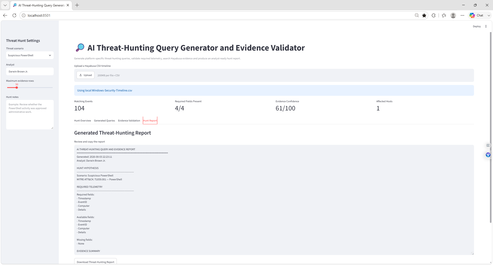

# Darwin-AI-Threat-Hunting-Query-Generator
Advanced SOC threat-hunting dashboard that generates KQL, Splunk SPL, and Elastic EQL queries, validates required telemetry, searches Hayabusa evidence, calculates evidence confidence, and exports analyst-ready hunt reports.

---

## 🎯 Project Objectives

- Create structured threat-hunting hypotheses
- Generate Microsoft KQL queries
- Generate Splunk SPL queries
- Generate Elastic EQL queries
- Map hunts to MITRE ATT&CK
- Identify relevant Windows Event IDs
- Validate required telemetry fields
- Search a Hayabusa timeline for supporting evidence
- Explain why each event matched
- Calculate an evidence-confidence score
- Export matching evidence to CSV
- Generate a downloadable threat-hunting report
- Preserve analyst validation before escalation or containment

---

## 🧠 Why This Project Matters

Traditional SOC work is often reactive. Analysts receive an alert and investigate what already triggered.

Threat hunting is proactive.

A threat hunter begins with a hypothesis, such as:

```text
An attacker may be using encoded PowerShell commands to execute
obfuscated scripts on a Windows endpoint.
```

The analyst then:

1. Identifies the required telemetry.
2. Builds hunting queries.
3. Searches available evidence.
4. Reviews matching events.
5. Separates normal activity from suspicious activity.
6. Documents gaps in visibility.
7. Determines whether additional investigation is required.

This project demonstrates the difference between:

```text
A query matching an event
```

and:

```text
Evidence confirming malicious activity
```

A matching Event ID alone is not enough to prove an attack.

---

## 🛠️ Technologies Used

- Python
- Streamlit
- Pandas
- Hayabusa
- Windows Security Event Logs
- Microsoft KQL
- Splunk SPL
- Elastic EQL
- MITRE ATT&CK
- PowerShell
- CSV processing
- SOC threat-hunting methodology
- Evidence-confidence scoring

---

## 🏗️ Project Workflow

```text
Threat Hypothesis
        ↓
Scenario Selection
        ↓
MITRE ATT&CK Mapping
        ↓
Relevant Event IDs
        ↓
Required Telemetry Validation
        ↓
KQL / SPL / EQL Generation
        ↓
Hayabusa Evidence Search
        ↓
Evidence Confidence Score
        ↓
Analyst Validation
        ↓
Threat-Hunting Report
```

---

## 📁 Repository Structure

```text
Darwin-AI-Threat-Hunting-Query-Generator/
│
├── threat_hunter.py
├── README.md
├── requirements.txt
├── .gitignore
│
├── screenshots/
│   ├── 01-AI-Threat-Hunting-Overview.png
│   ├── 02-AI-Generated-KQL-SPL-Elastic-Queries.png
│   ├── 03-AI-Threat-Hunt-Evidence-Validation.png
│   └── 04-AI-Threat-Hunting-Report.png
│
└── reports/
```

The original Hayabusa timeline is intentionally excluded because it may contain usernames, hostnames, email addresses, security identifiers, IP addresses, logon data, and process information.

---

## ⚙️ Environment Setup

### 1. Create the project folder

```powershell
cd "C:\Users\Darwin Brown\Downloads"
mkdir AI-Threat-Hunting-Query-Generator
cd .\AI-Threat-Hunting-Query-Generator
```

### 2. Create a virtual environment

```powershell
python -m venv huntvenv
```

### 3. Activate the environment

```powershell
.\huntvenv\Scripts\Activate.ps1
```

### 4. Install the required packages

```powershell
python -m pip install streamlit pandas
```

### 5. Copy the Hayabusa timeline

```powershell
Copy-Item "C:\Users\Darwin Brown\Downloads\hayabusa-3.10.0-win-x64\Windows-Security-Timeline.csv" ".\Windows-Security-Timeline.csv"
```

### 6. Create supporting folders

```powershell
mkdir screenshots
mkdir reports
```

---

## ▶️ Running the Application

Start the dashboard with:

```powershell
streamlit run threat_hunter.py
```

If the `streamlit` command is unavailable, run:

```powershell
.\huntvenv\Scripts\streamlit.exe run threat_hunter.py
```

Open the dashboard at:

```text
http://localhost:8501
```

Keep the PowerShell window open while using the application.

---

## 📥 Timeline Input

The application accepts a Hayabusa CSV timeline through:

- The local `Windows-Security-Timeline.csv` file
- The Streamlit upload control

The application attempts to normalize these fields:

```text
Timestamp
RuleTitle
Level
EventID
Computer
Details
Channel
RuleID
```

This helps the dashboard tolerate small differences in timeline column names.

---

## 🔎 Supported Threat Scenarios

The dashboard includes the following threat-hunting scenarios:

### Suspicious PowerShell

```text
MITRE ATT&CK: T1059.001 — PowerShell
Relevant Event IDs: 4103, 4104, 4688, 1
```

Example indicators:

```text
powershell
pwsh
encodedcommand
-enc
downloadstring
invoke-expression
iex
```

### Failed Logon Attack

```text
MITRE ATT&CK: T1110 — Brute Force
Relevant Event IDs: 4625, 4771, 4776
```

### Credential Access

```text
MITRE ATT&CK: T1003 — OS Credential Dumping
Relevant Event IDs: 4656, 4663, 4688, 10
```

### Privilege Escalation

```text
MITRE ATT&CK: T1068 — Exploitation for Privilege Escalation
Relevant Event IDs: 4672, 4673, 4674, 4688
```

### Persistence

```text
MITRE ATT&CK: T1547 — Boot or Logon Autostart Execution
Relevant Event IDs: 4697, 7045, 4657, 106, 140
```

### Lateral Movement

```text
MITRE ATT&CK: T1021 — Remote Services
Relevant Event IDs: 4624, 4648, 4688, 5140, 5145
```

### Account Manipulation

```text
MITRE ATT&CK: T1098 — Account Manipulation
Relevant Event IDs: 4720, 4722, 4724, 4728, 4732, 4756
```

---

## 🧪 Threat-Hunting Hypothesis

The project demonstration focused on:

```text
Suspicious PowerShell
```

The hypothesis was:

```text
A threat actor may be using encoded or obfuscated PowerShell
commands to execute scripts on a Windows endpoint.
```

The application mapped the hunt to:

```text
T1059.001 — PowerShell
```

The required fields were:

```text
Timestamp
EventID
Computer
Details
```

During the demonstration, all four required fields were present.

---

## 📊 Project Results

The Suspicious PowerShell hunt produced:

```text
104 matching events
4 of 4 required fields present
61/100 evidence confidence
1 affected host
```

The confidence label was:

```text
Partial Supporting Evidence
```

This means the dataset contained relevant telemetry and matching Event IDs, but the visible evidence was not enough to confirm suspicious PowerShell execution.

---

## 🧮 Evidence-Confidence Scoring

The application calculates an explainable score from several components.

### Telemetry coverage

Up to:

```text
30 points
```

The score increases when the required fields are available and populated.

### Matching evidence

```text
25 points
```

The application adds points when events match the scenario criteria.

### Relevant Event ID coverage

Up to:

```text
25 points
```

The score increases based on how many relevant Event IDs appear in the results.

### Keyword-supported evidence

Up to:

```text
20 points
```

More keyword-supported events increase the score.

---

## 🚦 Confidence Labels

```text
75–100: Strong Supporting Evidence
45–74:  Partial Supporting Evidence
20–44:  Limited Supporting Evidence
0–19:   Insufficient Evidence
```

These labels measure support for the hunt hypothesis.

They do not measure whether an endpoint is compromised.

---

## 🧾 Generated Microsoft KQL

The Suspicious PowerShell scenario generates a starter Microsoft Defender query similar to:

```kusto
DeviceProcessEvents
| where FileName in~ ("powershell.exe", "pwsh.exe")
| where ProcessCommandLine has_any (
    "-enc",
    "-encodedcommand",
    "downloadstring",
    "invoke-expression",
    "iex"
)
| project Timestamp,
          DeviceName,
          AccountName,
          FileName,
          ProcessCommandLine,
          InitiatingProcessFileName
| order by Timestamp desc
```

The query searches for PowerShell processes containing common encoded or obfuscated command indicators.

---

## 🧾 Generated Splunk SPL

The application also generates a starter SPL query:

```spl
index=windows
(
    EventCode=4688
    OR EventCode=4104
    OR EventCode=4103
)
(
    New_Process_Name="*powershell.exe"
    OR New_Process_Name="*pwsh.exe"
    OR CommandLine="*-enc*"
    OR CommandLine="*-encodedcommand*"
    OR ScriptBlockText="*downloadstring*"
    OR ScriptBlockText="*invoke-expression*"
)
| table _time, host, user, EventCode,
        New_Process_Name, CommandLine,
        ScriptBlockText
| sort - _time
```

The index and field names must be adjusted for the target Splunk environment.

---

## 🧾 Generated Elastic EQL

The generated Elastic query is similar to:

```text
process
where host.os.type == "windows"
  and process.name : ("powershell.exe", "pwsh.exe")
  and process.command_line : (
    "*-enc*",
    "*-encodedcommand*",
    "*downloadstring*",
    "*invoke-expression*",
    "*iex*"
  )
```

Field names and ECS normalization must be verified before operational use.

---

## ⚠️ Query Validation

Generated queries are starting points.

Before using them, the analyst must verify:

- Table names
- Index names
- Field names
- Event normalization
- Time fields
- Case sensitivity
- Data-source availability
- Operating-system filters
- Query syntax
- SIEM permissions

A query that works in one environment may fail in another because the underlying schema is different.

---

## 🔍 Evidence Validation

The application searches the Hayabusa timeline using:

- Relevant Event IDs
- Threat keywords
- Rule titles
- Event details
- Host information

Each result includes an `EvidenceReason`, such as:

```text
Relevant Event ID
Threat keyword match
```

The matching evidence can be downloaded as:

```text
Threat-Hunt-Evidence.csv
```

---

## ⚠️ Important Evidence Limitation

Many visible results matched because they used:

```text
Event ID 4688
```

Event ID 4688 records process creation.

The visible evidence included normal Windows processes such as:

```text
lsass.exe
services.exe
winlogon.exe
csrss.exe
smss.exe
autochk.exe
```

These processes are not automatically suspicious.

The events supported the fact that process-creation telemetry was available, but they did not by themselves confirm encoded PowerShell execution.

This is why the result was classified as:

```text
Partial Supporting Evidence
```

rather than confirmed malicious activity.

---

## 🕵️ Recommended Analyst Investigation

For a Suspicious PowerShell hunt, the analyst should review:

1. Whether `powershell.exe` or `pwsh.exe` actually appears.
2. The complete process command line.
3. The parent process.
4. The initiating user.
5. The affected host.
6. Encoded-command parameters.
7. Script-block logging.
8. Network connections created by PowerShell.
9. Downloaded files or payloads.
10. Child processes.
11. Whether the activity was approved.
12. Whether the same behavior occurred on other hosts.

Relevant logs may include:

```text
PowerShell Event ID 4103
PowerShell Event ID 4104
Windows Security Event ID 4688
Sysmon Event ID 1
```

---

## 📄 Generated Threat-Hunting Report

The report includes:

```text
Hunt Hypothesis
MITRE ATT&CK Mapping
Required Telemetry
Available Telemetry
Missing Telemetry
Evidence Summary
Confidence Score
Confidence Reasons
Recommended Analyst Actions
Analyst Notes
Validation Reminder
```

The report can be downloaded as:

```text
AI-Threat-Hunting-Report.txt
```

---

## 📸 Screenshots

### 1. AI Threat-Hunting Overview



The overview shows:

- Suspicious PowerShell scenario
- MITRE ATT&CK T1059.001
- Relevant Windows Event IDs
- Threat keywords
- 104 matching events
- All required fields present
- Evidence confidence of 61/100
- One affected host
- Available telemetry
- No missing required fields
- Partial supporting evidence

---

### 2. Generated KQL, SPL, and Elastic Queries



The generated-query view includes:

- Microsoft KQL
- Splunk SPL
- Elastic EQL
- PowerShell process filtering
- Encoded-command indicators
- Query download controls
- Schema-validation warning

The screenshot displays the Microsoft KQL query while the SPL and Elastic queries remain available through separate tabs.

---

### 3. Threat-Hunt Evidence Validation



The evidence view shows:

- Matching Hayabusa records
- Event timestamps
- Detection titles
- Severity levels
- Event IDs
- Computer names
- Evidence reasons
- Original event details
- CSV export control
- Analyst-validation reminder

The visible Event ID 4688 records demonstrate telemetry availability but include several normal Windows processes.

---

### 4. Threat-Hunting Report



The generated report shows:

- Analyst name
- Hunt hypothesis
- MITRE ATT&CK mapping
- Required fields
- Available fields
- Missing-field results
- Evidence summary
- Download report button

---

## 🧠 Human-in-the-Loop Validation

The application does not automatically:

- Confirm an attack
- Confirm endpoint compromise
- Escalate an incident
- Block an IP address
- Disable an account
- Isolate a computer
- Deploy a detection rule
- Run queries against a production SIEM
- Close an investigation

The analyst remains responsible for:

- Reviewing original evidence
- Validating query syntax
- Confirming field mappings
- Distinguishing normal from suspicious activity
- Documenting false positives
- Determining whether escalation is justified

---

## ⚠️ Current Limitations

- Generated queries are templates
- No live SIEM connection
- No EDR integration
- No official Sigma conversion
- No threat-intelligence enrichment
- No host or user behavioral baseline
- Evidence search uses broad Event ID and keyword matching
- Event ID matches may include normal events
- Confidence scoring is demonstration logic
- No persistent investigation database
- No case ownership
- No automatic query testing
- No local generative AI model in the current displayed version

The project name includes AI because it is designed as an AI-assisted hunting workflow and can later add local model-generated hypotheses and query recommendations.

---

## 🔮 Future AI Integration

A future Ollama integration could:

- Generate threat hypotheses
- Explain detection gaps
- Draft KQL, SPL, and EQL queries
- Recommend relevant Event IDs
- Suggest MITRE ATT&CK mappings
- Compare query logic
- Identify missing telemetry
- Summarize matching evidence
- Suggest false-positive scenarios
- Draft escalation notes
- Recommend follow-up hunts

All AI-generated content would still require analyst validation.

---

## 🚀 Future Improvements

- Add local Ollama query generation
- Add live Microsoft Sentinel execution
- Add Microsoft Defender advanced hunting
- Add Splunk API integration
- Add Elastic API integration
- Add Sigma-rule conversion
- Add query-syntax validation
- Add query execution timers
- Add host and user baselines
- Add process-tree visualization
- Add parent-child process correlation
- Add PowerShell command decoding
- Add timeline charts
- Add evidence bookmarking
- Add analyst comments
- Add investigation status tracking
- Add SQLite storage
- Add case-number generation
- Add confidence tuning
- Add false-positive feedback
- Add PDF report export
- Add threat-intelligence enrichment

---

## 🧠 What I Learned

- How proactive threat hunting differs from alert triage
- How to define a threat hypothesis
- How to map a hunt to MITRE ATT&CK
- How to identify required telemetry
- How to generate KQL starter queries
- How to generate SPL starter queries
- How to generate Elastic EQL starter queries
- How to search Hayabusa evidence
- How to validate available log fields
- How to calculate an explainable evidence score
- Why an Event ID match does not prove malicious activity
- How normal Windows processes can appear in hunt results
- How to generate analyst-ready threat-hunting reports
- Why query results require human review

---

## 💼 Skills Demonstrated

- SOC threat hunting
- Threat-hypothesis development
- Windows Event Log analysis
- Hayabusa
- Microsoft KQL
- Splunk SPL
- Elastic EQL
- MITRE ATT&CK
- Python
- Streamlit
- Pandas
- PowerShell
- CSV processing
- Data normalization
- Evidence validation
- Confidence scoring
- Process-creation analysis
- False-positive analysis
- Analyst reporting
- Human-in-the-loop security automation

---

## 🔐 Privacy and Evidence Handling

Windows timelines may contain:

- Usernames
- Email addresses
- Computer names
- Domain names
- IP addresses
- Security identifiers
- Process command lines
- Logon identifiers
- Account information
- Authentication details

Do not upload unredacted event data to a public repository.

Exclude:

```text
Windows-Security-Timeline.csv
Threat-Hunt-Evidence.csv
AI-Threat-Hunting-Report.txt
*.evtx
huntvenv/
```

---

## 🧹 Recommended `.gitignore`

```gitignore
huntvenv/
venv/
.env
__pycache__/
*.pyc
*.log
*.evtx

Windows-Security-Timeline.csv
Threat-Hunt-Evidence.csv
AI-Threat-Hunting-Report.txt

reports/*
!reports/.gitkeep
```

---

## 📦 Suggested `requirements.txt`

```text
streamlit
pandas
```

Create it manually or run:

```powershell
python -m pip freeze > requirements.txt
```

A manually maintained file with only the direct dependencies is cleaner for this project.

---

## ⚠️ Disclaimer

This project was completed in a controlled environment using Windows event data from a personally controlled system.

It is intended only for:

- Cybersecurity education
- SOC analyst training
- Defensive threat hunting
- Query-development practice
- Evidence-validation practice
- Portfolio development

No unauthorized systems were accessed.

Generated queries and evidence-confidence scores must not be used as the sole basis for containment, incident confirmation, or disciplinary action.

---

## 🙏 Project Credit

The source timeline was generated using **Hayabusa**, an open-source Windows event-log threat-hunting and fast-forensics tool maintained by Yamato Security.

This repository documents my own:

- Streamlit application
- Threat-scenario templates
- KQL query generation
- SPL query generation
- Elastic query generation
- Telemetry validation
- Evidence search
- Confidence scoring
- Report generation
- Screenshots
- SOC threat-hunting workflow

- Author: Darwin Brown
- Aspiring SOC Teir 1
